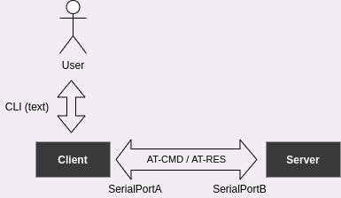

# Serial Port Communication

Expected duration: **1-2 days**

## Overview

Create a system with an **AT-Command based server** and a **cli-enabled client** that communicates with it via a serial port.

## Requirements:

* Any linux distro
* C Language
* CMake

## Description

The desired solution should consist of two different apps, one for the server and one for the client, that communicate via a serial port connection. The server waits for commands and sends back the appropriate responses.




#### Serial Communication
The serial port should be emulated using a virtual serial port (pts). You can use `socat` or any other tool that you are familiar with, but the final solution should read/write to tty-like files. 

The exchanged payload is ASCII string.

AT-Command Format: `AT+<CMD>` followed by a newline (<CMD> should be replaced with the desired command from the list below).
AT-Response Format: `<RES>` followed by a newline (<RES> will match the expected output of the input <CMD>).

Example: Command=`AT+REG1`, Response=`5`.

AT-Commands/Responses:
* `REG1`: Read the 1st register's value -> Response: `<int>`
* `REG1=?`: Read the list of all allowed values for 1st register (allows 2byte integers) -> Response: `0-16535`
* `REG1=<int>`: Write the provided integer to the 1st register -> Response: `OK|InvalidInput`
* `REG2`: Read the 2nd register's value -> Response: `<int>`
* `REG2=?`: Read the list of all allowed values for 2nd -> Response: `1|2|3`
* `REG2=<int>`: Write the provided integer to the 2nd register -> Response: `OK|InvalidInput`
* ...
* For each register:
  * `REG<N>`: Read the Nth register's value
  * `REG<N>=?`: Read the list of all allowed values for the Nth register
  * `REG<N>=<int>`: Write the provided integer to Nth register

***NOTES***
 - The error checking regarding the supported commands and the corresponding values is the responsibility of the server and not the client.
 - You can add as many registers as you like but you should have at least 2 to demonstrate the **discrete** (e.g. 1|2|3) and **range** (0-255) value types.
 - Feel free to choose default values for registers.
 - The list of registers (number of registers and the type and the default value of each register) should be dynamic and the solution should provide a way to upgrade it, either at compile-time (e.g. by editing an array of such entries at the code files) or at runtime, by providing a way to add a register to the system via a custom **add-register** command).

#### CLI
The client should provide a simple CLI for interaction with the user:

It should provide a prompt for user input:

* help -> prints all available AT Commands
* `AT+<CMD>` -> sends the command and prints back the result (response or error). Example: AT+REG1=3 -> OK

Example:

```
~ help
Available AT Commands:

- REG1: Read the register-1 value -> Response: <int>
...

~ AT+REG1
1
~ AT+REG1=5
OK
~ AT+REG1
5
~ AT+REG2=?
1|2|3

```

#### Deliverables

1. Git repository (Gitlab, Github, feel free to choose) (if you make it private don't forget invite us).
2. Server Application
3. Client Application
4. Guide for editing the list of registers, compiling and running the applications
5. Provide CMake based toolchain for both applications

***You can share any code you like between the two applications using common library architecture (common.(c|h))***
